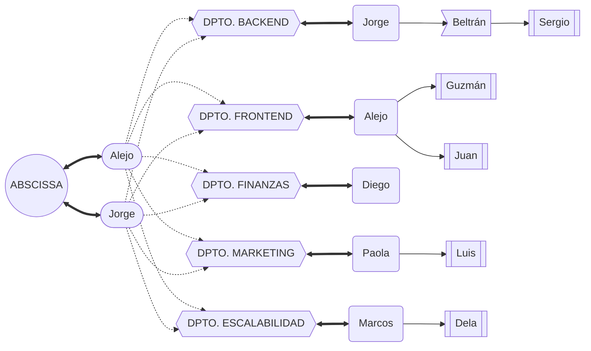

## Miembros

### Resumen de miembros actuales

- [X] Alejo

- [X] Beltrán

- [X] Diego

- [X] Dela

- [X] Guzmán

- [X] Jorge

- [X] Juan

- [X] Luis

- [X] Marcos

- [X] Paola

- [X] Sergio

### Jerarquía de trabajo

